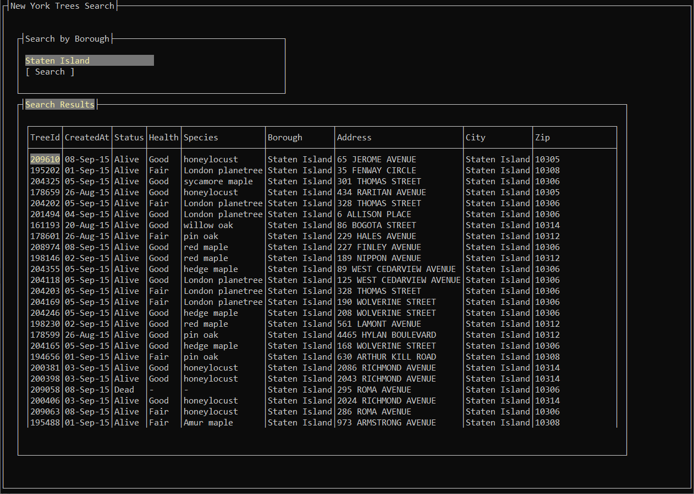

# New York Trees

A simple search interface for New York's public [City Tree Census](https://dev.socrata.com/foundry/data.cityofnewyork.us/uvpi-gqnh) data.

Built with:
* .NET 8
* Terminal.Gui (v2 pre-release)
* ReactiveUI

## But why though

This project was built to be a "substantial enough" example of an MVVM [Terminal.Gui](https://github.com/gui-cs/Terminal.Gui) program, with [ReactiveUI](https://github.com/reactiveui/ReactiveUI) handling communication between the View and ViewModel layers.

I'm really only attempting to illustrate principles here, there may be substantial issues with stability; but I have done my best to eliminate them when possible. It's also probably worth mentioning that I'm still learning, and I've actually never worked with ReactiveUI before. If you have feedback, I'd love to hear it. 😁

## Usage

Build, compile, run. The search field offers autocomplete. Later versions will save you from crashing everything by typing something other than a borough of New York City in that field.

